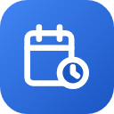
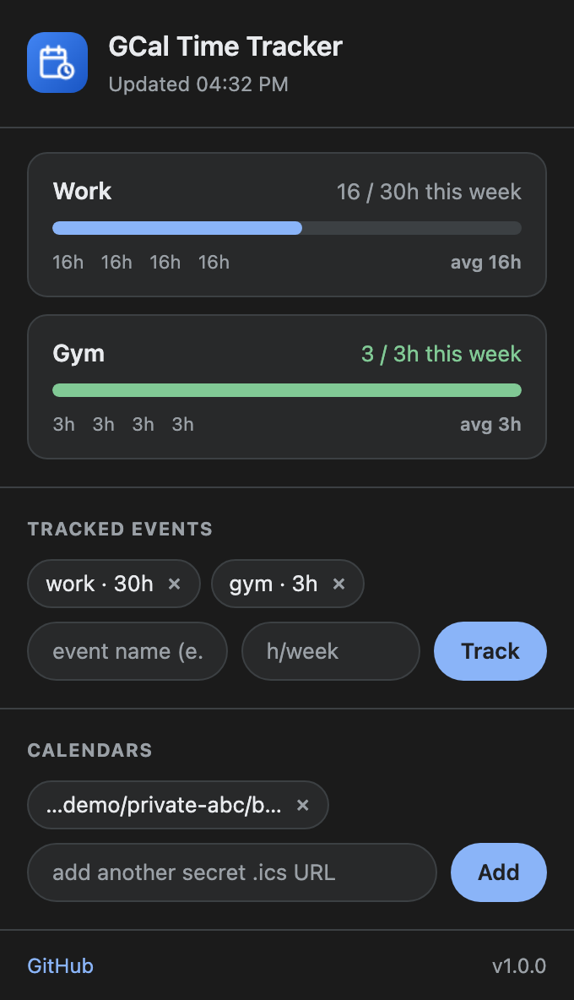
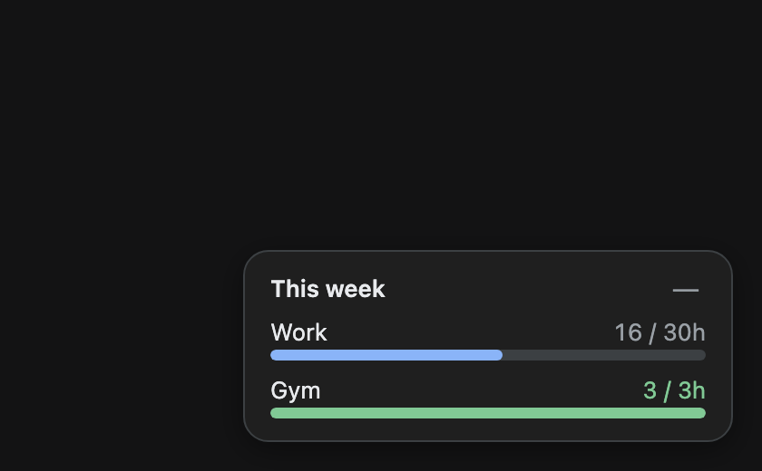

<p align="center">
  
</p>

<h1 align="center">GCal Time Tracker</h1>

<p align="center">
  <a href="LICENSE"></a>
  
  
</p>

<p align="center">
  Brave/Chrome extension that answers one question:<br>
  <b>"how many hours of <i>work</i> did I actually plan this week?"</b><br>
  Pick event names, set weekly targets, see progress — right inside Google Calendar.
</p>

---

## What it does

- **Track any event by name** — `work` matches `Work`, `Deep Work`, `Work: calls` (case-insensitive substring)
- **Weekly targets** — "30h of work, 3h of gym" → progress bars turn green when you hit them
- **Floating widget on calendar.google.com** — your week's progress always visible, collapsible to a pill
- **History** — last 4 weeks + average per tracked event in the popup
- No OAuth, no API keys — reads your calendar's **secret iCal URL**. No background tracking, no analytics.

| Popup | Widget on Google Calendar |
|---|---|
|  |  |

## Install in Brave

1. Open `brave://extensions`
2. Enable **Developer mode** (top right)
3. Click **Load unpacked** (or drag this folder onto the page)
4. Select the `gcal-time-tracker` folder

Same steps work in Chrome at `chrome://extensions`.

## Connect your calendar (once)

1. Open [Google Calendar](https://calendar.google.com) → ⚙ **Settings**
2. Click your calendar in the left sidebar → **Integrate calendar**
3. Copy **"Secret address in iCal format"** (keep it private — it grants read access)
4. Click the extension icon → paste the URL → **Connect**
5. Add tracked events: name + optional hours/week target

Multiple calendars? Add more URLs — they're merged.

## How it works

- Fetches your secret `.ics` feed and parses it with [ical.js](https://github.com/kewisch/ical.js)
- Expands recurring events properly: cancelled instances (EXDATE) don't count, moved instances count at their new time, all-day events are skipped (they're not time blocks)
- Weeks run Monday–Sunday; "this week" includes upcoming scheduled hours
- Settings sync via `chrome.storage.sync`; the widget refreshes every 30 minutes

## Development & testing

```bash
bun install                # or npm install
bunx playwright install chromium

bun run test               # 13 offline checks: recurrence math (cancelled/moved
                           # instances, all-day exclusion), popup render, widget render
bun run icons              # regenerate extension icons
bun run shots              # regenerate README screenshots
```

## Caveats

- Google refreshes secret iCal feeds with a few hours' lag — an event you added minutes ago may not show yet
- The widget reflects *scheduled* time, not attended time — it counts what's on the calendar
- Hours are bucketed by the week the event *starts* in (a Sun 23:00–Mon 02:00 block counts fully toward Sunday's week)

## License

[MIT](LICENSE)
